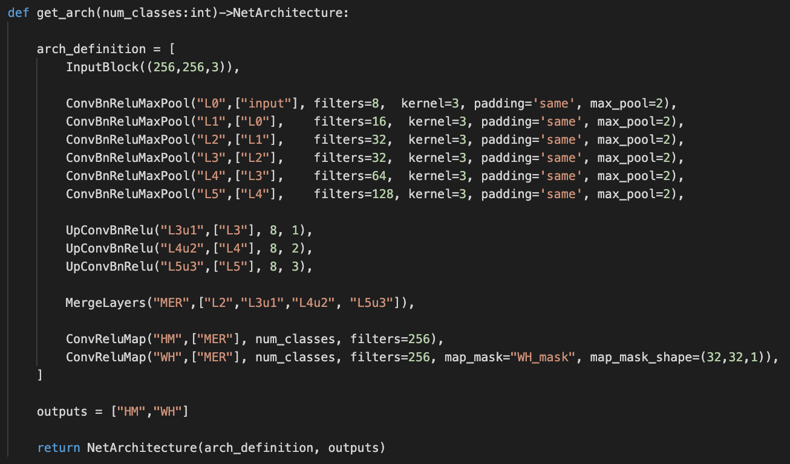

# Object Detection Research & Development

This repository implements top level mini-framework to allow fast creation of object detection neural networks with branches. 

The project is developed exclusively by [Błażej Matuszewski](https://github.com/bwosh).

# Status

The project is in very early stage.  
Some concepts are being implemented.

# Dependencies
Used versions of libraries during development:  
- tensorflow : 2.1.0
- numpy : 1.18.2
- OpenCV : 4.2.0
- scipy : 1.4.1
- tqdm: 4.44.1

# References

The code may be using some concepts described in:

**Feature extraction:**  
- [Deep Layer Aggregation](https://arxiv.org/pdf/1707.06484.pdf) [Jul 2017]
- [EfficientNet: Rethinking Model Scaling for Convolutional Neural Networks](https://arxiv.org/pdf/1905.11946.pdf) [May 2019]
- [EfficientDet: Scalable and Efficient Object Detection](https://arxiv.org/pdf/1911.09070.pdf) [Nov 2019]
- [YOLOv4: Optimal Speed and Accuracy of Object Detection](https://arxiv.org/pdf/2004.10934.pdf) [Apr 2020]

**Bounding box generation:**
- [Objects as Points](https://arxiv.org/pdf/1904.07850.pdf) [Apr 2019]

**Low performace devices optimizations:**
- [FaceBoxes: A CPU Real-time Face Detector with High Accuracy](https://arxiv.org/pdf/1708.05234.pdf) [Aug 2017]
- [Real-Time Multi-Scale Face Detector on Embedded Devices](https://www.researchgate.net/publication/332998926_Real-Time_Multi-Scale_Face_Detector_on_Embedded_Devices) [Mar 2019]
- [CenterMask : Real-Time Anchor-Free Instance Segmentation](https://arxiv.org/pdf/1911.06667.pdf) [Nov 2019]
- [ThunderNet: Towards Real-time Generic Object Detection](https://arxiv.org/pdf/1903.11752.pdf) [Mar 2019]
- [An Energy and GPU-Computation Efficient Backbone Network for Real-Time Object Detection](https://arxiv.org/pdf/1904.09730v1.pdf) [Apr 2019]

**High efficiency approaches:**
- [FASTERSEG: SEARCHING FOR FASTER REAL-TIME SEMANTIC SEGMENTATION](https://arxiv.org/pdf/1912.10917.pdf) [Dec 2019]

**Circural convolution:**
- [Deep Snake for Real-Time Instance Segmentation](https://arxiv.org/pdf/2001.01629.pdf) [Jan 2020]
- [Fast Interactive Object Annotation with Curve-GCN](https://arxiv.org/pdf/1903.06874.pdf) [Mar 2019]

**Simplicity:**
- [Frustratingly Simple Few-Shot Object Detection](https://arxiv.org/pdf/2003.06957v1.pdf) [Mar 2020]

**Data augmentation:**
- [Albumentations: fast and flexible image
augmentations](https://arxiv.org/pdf/1809.06839.pdf) [Sep 2018]
- [AUGMIX: A SIMPLE DATA PROCESSING METHOD TO
IMPROVE ROBUSTNESS AND UNCERTAINTY](https://arxiv.org/pdf/1912.02781.pdf) [Dec 2019]

**Surveys:**
- [Recent Advances in Object Detection in the Age of Deep Convolutional Neural Networks](https://arxiv.org/pdf/1809.03193.pdf) [Sep 2018]
- [Deep Learning for Generic Object Detection: A Survey](https://arxiv.org/pdf/1809.02165.pdf) [Sep 2018]
- [Object Detection in 20 Years: A Survey](https://arxiv.org/pdf/1905.05055.pdf) [May 2019]
- [A Survey of Deep Learning-based Object Detection](https://arxiv.org/pdf/1907.09408.pdf) [Jul 2019]
- [Recent Advances in Deep Learning for Object Detection](https://arxiv.org/pdf/1908.03673.pdf) [Aug 2019]
- [Imbalance Problems in Object Detection: A Review](https://arxiv.org/pdf/1909.00169.pdf) [Sep 2019]

# License

**ODRND - Object Detection Research And Development Framework**  
*Code that makes coplex neural network architectures simplier.*  

Copyright (C) 2020  [Błażej Matuszewski](https://github.com/bwosh)

This program is free software: you can redistribute it and/or modify
it under the terms of the GNU General Public License as published by
the Free Software Foundation, either version 3 of the License, or
(at your option) any later version.

This program is distributed in the hope that it will be useful,
but WITHOUT ANY WARRANTY; without even the implied warranty of
MERCHANTABILITY or FITNESS FOR A PARTICULAR PURPOSE.  See the
GNU General Public License for more details.

You should have received a copy of the GNU General Public License
along with this program.  If not, see <https://www.gnu.org/licenses/>.

If you need to use software in proprietary, non-open-source code: [licence exceptions](https://www.fsf.org/blogs/rms/selling-exceptions) may be obtained after contacting me.