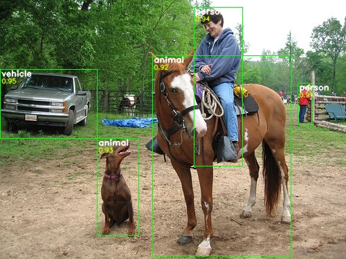

# Object Detection Research & Development

This open-source repository is a space for Object Detecton Research with ARM-based devices performance in mind.

# Goals
1. Push low-end Android device (**Xiaomi Redmi 7A**) to its object detection (3 classes) FPS limits using:
    - recent findings in Computer Vision
    - TFLite delegates for: NNAPI, GPU, Hexagon
2. Push **Raspberry Pi Zero W** to its object detection (3 classes) FPS limits using:
    - recent findings in Computer Vision
    - OpenCL implementation on VideoCore IV GPU

*3 classes mentioned above are: person, vehicle, animal*
# Details

You can navigate to the details here:

- **STATUS**: [Current status of the project](./assets/status.md#readme)
- **SRC**: [Training the networks/Using the code](./src#readme)
- **PERFORMANCE**: [Target devices and performance tests](./performance#readme)
- **REFERENCES**: [List of inspiring papers](./assets/references.md#readme)

# License

**ODRND - Object Detection Research And Development**  
Copyright (C) 2020  [Błażej Matuszewski](https://github.com/bwosh)

This program is free software: you can redistribute it and/or modify
it under the terms of the GNU General Public License as published by
the Free Software Foundation, either version 3 of the License, or
(at your option) any later version.

This program is distributed in the hope that it will be useful,
but WITHOUT ANY WARRANTY; without even the implied warranty of
MERCHANTABILITY or FITNESS FOR A PARTICULAR PURPOSE.  See the
GNU General Public License for more details.

You should have received a copy of the GNU General Public License
along with this program.  If not, see <https://www.gnu.org/licenses/>.

If you need to use software in proprietary, non-open-source code: [licence exceptions](https://www.fsf.org/blogs/rms/selling-exceptions) may be obtained after contacting me.